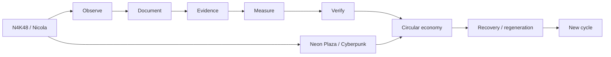
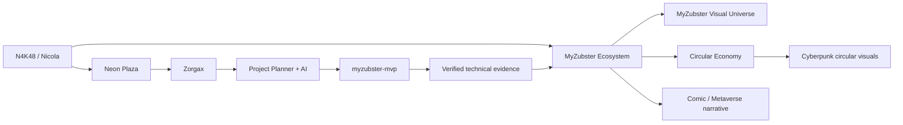

# N4K48 // MyZubster MVP

<p align="center">
  <a href="https://github.com/MyZubster-Ecosystem/myzubster">
    
  </a>
</p>

<p align="center">
  <strong>N4K48 · EXPLORER · NEON PLAZA · CYBERPUNK · CIRCULAR ECONOMY · MYZUBSTER</strong><br>
  Profilo visuale di Nicola collegato all'ecosistema MyZubster, all'universo cyberpunk e al percorso di economia circolare.
</p>

<p align="center">
  <a href="https://github.com/MyZubster-Ecosystem/myzubster"><strong>MYZUBSTER CORE</strong></a> ·
  <a href="https://github.com/MyZubster-Ecosystem/MyZubster-Visual"><strong>VISUAL UNIVERSE</strong></a> ·
  <a href="https://github.com/MyZubster-Ecosystem/myzubster/blob/main/docs/visuals/MyZubster-Economia-Circolare-Cyberpunk.jpg"><strong>CIRCULAR ECONOMY</strong></a> ·
  <a href="https://github.com/MyZubster-Ecosystem/myzubster/blob/main/public/fumetto.html"><strong>COMIC UNIVERSE</strong></a> ·
  <a href="docs/N4K48.md"><strong>N4K48 PROFILE</strong></a>
</p>

> **Virtual identity:** N4K48  
> **Archetype:** Explorer  
> **Entry point:** Neon Plaza  
> **Operational path:** Project Planner + AI/Zorgax  
> **MyZubster connection:** ecosystem participant / visual profile  
> **Circular economy connection:** visual/concept + evidence-first path  
> **Repository status:** MVP in sviluppo e validazione, non production-ready

## Nicola Comics × MyZubster

**Tre tavole pubblicate:** il percorso di N4K48 dalla propria idea software allo sviluppo e alla visione del metaverso.

[**Apri la galleria completa**](docs/n4k48-comics/README.md) · [Avanzamento del progetto](docs/n4k48-comics/ROADMAP.md)

1. [Dall’idea software al metaverso](docs/n4k48-comics/01-dall-idea-al-metaverso.png)
2. [Il software prende forma](docs/n4k48-comics/02-il-software-prende-forma.png)
3. [Verso Neon Plaza](docs/n4k48-comics/03-verso-neon-plaza.png)

Visual realizzate con assistenza AI e con le sembianze N4K48 scelte da Nicola. Le scene raccontano il progetto; gli ambienti futuri restano concept in sviluppo.

## N4K48 Project Planner AI/Zorgax

**Build and publish a digital product in seven days with an AI guide that organizes the work, identifies mistakes and recommends the next action.**

N4K48 Project Planner is an experimental product-planning assistant developed as part of the MyZubster journey. It is designed for people who want to create a digital product but struggle with too many steps, unclear priorities, deadlines and mistakes discovered too late.

The planner helps users:

- define one concrete objective;
- divide the objective into manageable activities;
- understand what to do next;
- identify missing or incorrect steps;
- monitor deadlines and progress;
- document completed work and supporting evidence;
- prepare a product for publication.

Zorgax represents the AI guidance layer. Its role is to assist with planning, analysis and error detection while keeping important decisions under human control.

### Seven-day outcome

> Can an AI-guided project planner help someone produce a concrete and verifiable result within seven days?

### Current status

- Product idea defined
- Public GitHub documentation available
- N4K48 identity and visual profile published
- MyZubster authenticated flow tested
- 27 automated tests passed
- First public DEV.to article published
- Seven-day product test in progress
- User validation still partial
- Public production release not yet available

### Project links

- [GitHub profile](https://github.com/nicolaususnicola-lgtm)
- [MyZubster repository](https://github.com/nicolaususnicola-lgtm/myzubster)
- [Independent MVP](https://github.com/nicolaususnicola-lgtm/myzubster-mvp)
- [Public roadmap](https://github.com/nicolaususnicola-lgtm/myzubster/blob/main/ROADMAP_N4K48_METAVERSE.md)
- [DEV.to article](https://dev.to/n4k48/building-n4k48-my-journey-with-myzubster-ai-and-neon-plaza-3nbp)

This is an experimental MVP under development. Documentation, visuals and local test results do not by themselves demonstrate production deployment, commercial adoption, external payments or third-party endorsement.

## N4K48 × Cyberpunk × Economia Circolare

N4K48 collega il percorso tecnico di Nicola al linguaggio visuale cyberpunk di MyZubster e a un modello di economia circolare basato su osservazioni, documentazione ed evidenze. Il collegamento è progettuale e narrativo: **non attribuisce automaticamente risultati ambientali, accreditation o reward non verificati**.

<table>
<tr>
<td width="50%" align="center">
<a href="https://github.com/MyZubster-Ecosystem/myzubster/blob/main/docs/visuals/MyZubster-Economia-Circolare-Cyberpunk.jpg"></a><br><strong>N4K48 // CIRCULAR ECONOMY</strong>
</td>
<td width="50%" align="center">
<a href="https://github.com/MyZubster-Ecosystem/myzubster/blob/main/docs/visuals/MyZubster-Space-Station-Cyberpunk.jpg"></a><br><strong>N4K48 // SPACE STATION</strong>
</td>
</tr>
<tr>
<td colspan="2" align="center">
<a href="https://github.com/MyZubster-Ecosystem/myzubster/blob/main/docs/visuals/MyZubster-Pagamenti-Economia-Circolare.jpg"></a><br><strong>MYZUBSTER // CIRCULAR VALUE FLOW</strong>
</td>
</tr>
</table>

### Circular path



> **Evidence boundary:** integrità tecnica e visual storytelling non equivalgono da soli a validazione fisica/scientifica. Stati come `verified` o `accredited` richiedono evidence e autorizzazioni appropriate.

## Visual identity // N4K48 × MyZubster

<table>
<tr>
<td width="50%" align="center">
<a href="https://github.com/MyZubster-Ecosystem/MyZubster-Visual/blob/main/assets/cyberpunk-series/MyZubster-Cyberpunk-Serie-01-Daniel-nel-Neon.png"></a><br><strong>MYZUBSTER // NEON LANGUAGE</strong>
</td>
<td width="50%" align="center">
<a href="https://github.com/MyZubster-Ecosystem/MyZubster-Visual/blob/main/assets/cyberpunk-series/MyZubster-Cyberpunk-Serie-04-Rete-Decentralizzata.png"></a><br><strong>MYZUBSTER // CONNECTED ECOSYSTEM</strong>
</td>
</tr>
<tr>
<td width="50%" align="center">
<a href="https://github.com/MyZubster-Ecosystem/MyZubster-Visual/blob/main/assets/zorgax/zorgax-cyberpunk-brand-ecosystem.jpg"></a><br><strong>ZORGAX // OPERATIONAL GUIDE</strong>
</td>
<td width="50%" align="center">
<a href="https://github.com/MyZubster-Ecosystem/MyZubster-Visual/blob/main/assets/comic/collaborazione-futura.png"></a><br><strong>MYZUBSTER // COLLABORATION</strong>
</td>
</tr>
</table>

### Connection graph



## N4K48 entra nel Metaverso MyZubster

N4K48 è l'identità virtuale scelta da Nicola per rappresentare il proprio percorso nel mondo visuale MyZubster. Il punto di partenza narrativo è **Neon Plaza**: un hub cyberpunk dal quale progetti, attività, evidenze e strumenti possono essere raccontati e collegati in modo visuale.

Il metaverso qui è una **rappresentazione narrativa / concept**, non una dichiarazione che esista già un ambiente 3D production-ready. Il repository contiene invece componenti tecnici reali e verificabili dell'MVP.

### Visual universe

| Visual | Ruolo |
| --- | --- |
| [Neon Plaza — H4X0R e N4K48](https://github.com/MyZubster-Ecosystem/myzubster/blob/main/docs/visuals/drive-import-2026-09-03/Neon-Plaza-H4X0R-N4K48-Cyberpunk.jpg) | Ingresso di N4K48 nel Metaverso MyZubster |
| [Economia Circolare Cyberpunk](https://github.com/MyZubster-Ecosystem/myzubster/blob/main/docs/visuals/MyZubster-Economia-Circolare-Cyberpunk.jpg) | Connessione N4K48 al percorso circolare |
| [Pagamenti Economia Circolare](https://github.com/MyZubster-Ecosystem/myzubster/blob/main/docs/visuals/MyZubster-Pagamenti-Economia-Circolare.jpg) | Rappresentazione del value flow circolare |
| [Space Station Cyberpunk](https://github.com/MyZubster-Ecosystem/myzubster/blob/main/docs/visuals/MyZubster-Space-Station-Cyberpunk.jpg) | Layer Space Station / cyberpunk |
| [MyZubster — Manifesto Neon](https://github.com/MyZubster-Ecosystem/MyZubster-Visual/blob/main/assets/comic/MyZubster-Cyberpunk-Visual-01-Manifesto-Neon.png) | Identità visuale dell'universo MyZubster |
| [MyZubster — Rete Decentralizzata](https://github.com/MyZubster-Ecosystem/MyZubster-Visual/blob/main/assets/cyberpunk-series/MyZubster-Cyberpunk-Serie-04-Rete-Decentralizzata.png) | Rappresentazione visuale dell'ecosistema connesso |
| [Zorgax Cyberpunk Brand Ecosystem](https://github.com/MyZubster-Ecosystem/MyZubster-Visual/blob/main/assets/zorgax/zorgax-cyberpunk-brand-ecosystem.jpg) | Zorgax come guida operativa e narrativa |

## First Mission

**Obiettivo narrativo:** trasformare l'ingresso di N4K48 in un percorso operativo verificabile.

1. Entrare nel Neon Plaza.
2. Collegare identità, progetto e stato del lavoro.
3. Usare il Project Planner / Zorgax come guida del percorso.
4. Produrre risultati concreti ed evidenze tecniche.
5. Collegare le evidenze al percorso di economia circolare quando applicabile.
6. Sbloccare il passo successivo soltanto sulla base di attività realmente completate.

## What MyZubster Is

MyZubster is an evidence-first platform for turning documented activities and observations into structured, searchable and eventually monetizable digital records.

The current MVP combines a data layer, semantic retrieval and local AI. The longer-term product direction adds a reward ledger, wallet and monetization layer. These stages must not be confused: planned wallet, reward and on-chain capabilities are not yet presented as implemented features.

### Current architecture

```text
Observation / activity
        ↓
Structured record + metadata
        ↓
JSON persistence
        ↓
Qdrant semantic index
        ↓
Relevant evidence
        ↓
Authoritative metadata answer ──┐
                                ├──→ MyZubster response
RAG context → local LLM ────────┘
```

The key design rule is **evidence first**:

- structured facts that the system already knows with certainty should be answered deterministically;
- unstructured questions can use RAG + a local LLM;
- the LLM should not override authoritative structured metadata;
- sources returned by the AI API remain visible to the caller.

For example, an observation can carry metadata such as:

```json
{
  "status": "RECORDED",
  "success": true,
  "paymentRequired": false,
  "onchainRecorded": false,
  "handoverId": "...",
  "method": "HAND_DELIVERY"
}
```

If a user asks whether that event was recorded on-chain, the answer is derived from `onchainRecorded`, rather than asking the language model to infer a boolean from prose.

### Economic provenance foundation

The MVP now includes domain primitives for recording economic and asset provenance without making legal ownership determinations.

- `RevenueEvent` records a revenue source, amount, currency, status and explicit participant allocations.
- `Allocation` stores the percentage rule used for a revenue event.
- `AssetCreatedEvent` records an asset's creator provenance, including NFTs.
- `calculate_allocations()` derives amounts only from explicit allocation rules.
- `create_nicola_nft_event()` records an NFT created by Nicola as a creator-provenance event; it does not infer legal ownership or market value.

The persistent MYZ ledger API is now implemented. It stores revenue and asset provenance events in the same persistent data volume as MyZubster observations. The API exposes `POST /api/ledger/revenue`, `POST /api/ledger/assets`, and `GET /api/ledger`.

Revenue events calculate participant amounts only from explicit allocation percentages. NFT asset events record creator provenance, including assets created by Nicola, without inferring legal ownership or market value.


### Product direction

The intended evolution is:

```text
Documented activity
        ↓
Evidence / verification
        ↓
Reward rule
        ↓
MYZ internal ledger
        ↓
User wallet / balance
        ↓
Monetization
        ↓
Optional future on-chain adapter
```

The MYZ layer is currently described as an **internal reward and accounting ledger**, not as an external currency. Wallet, reward and on-chain components remain roadmap work until they are implemented and tested in the repository.

### Revenue & ownership model (to be formalized)

The project is being designed around a separation between **project ownership**, **platform revenue**, and **contributions/assets created by individual participants**.

The current working model described by the project participants is:

| Revenue / asset area | Daniel | Nicola | Implementation principle |
| --- | --- | --- | --- |
| MyZubster online revenue | 2% according to the stated agreement | Remaining share according to the applicable agreement/cost structure | Revenue source must be recorded explicitly |
| Conversions | Share to be defined by the agreement | Share to be defined by the agreement | Separate conversion revenue from general platform revenue |
| Zorgax | Share to be defined by the agreement | Share to be defined by the agreement | Track Zorgax-related revenue separately |
| Software | Project ownership/right to be defined by agreement | Development, software and know-how contribution | Do not infer IP ownership from code commits alone |
| NFTs | Asset-specific ownership/creator rights | Assets attributable to Nicola where applicable | Each NFT should carry provenance and rights metadata |
| Knowledge / know-how | As agreed | Nicola's documented contribution | Record contribution without automatically assigning legal ownership |

These percentages and ownership fields are **business requirements to be formalized in an agreement**, not legal conclusions and not yet an implemented payment system.

The intended technical model is:

```text
Revenue / asset event
        ↓
Source + provenance
        ↓
Ownership / contribution rule
        ↓
Applicable revenue split
        ↓
MYZ internal ledger
        ↓
Participant balance / accounting record
        ↓
Optional future payout or on-chain adapter
```

The ledger should never infer ownership from an AI answer. Ownership, revenue splits and NFT rights must come from explicit configuration and/or authoritative records. This keeps the economic layer auditable and independent from the language model.

### Implemented vs planned

| Area | Status |
| --- | --- |
| Observation API and persistence | Implemented |
| Structured observation metadata | Implemented |
| Qdrant semantic retrieval | Implemented |
| Ollama local AI | Implemented |
| Evidence-first RAG prompting | Implemented |
| Deterministic answers for authoritative metadata | Implemented |
| Economic provenance primitives | Implemented |
| NFT creator provenance event | Implemented |
| MYZ reward ledger | Planned / roadmap |
| User wallet | Planned / roadmap |
| Monetization flows | Planned / roadmap |
| Optional on-chain adapter | Planned / roadmap |

## Cosa è già stato completato nel repository

Queste sono componenti tecniche reali già integrate nell'MVP:

- creazione di osservazioni via API con risposta HTTP `201`;
- persistenza JSON configurabile e scrittura atomica;
- recupero delle osservazioni e test end-to-end;
- validazione JSON e coordinate;
- Docker non-root per sviluppo locale;
- volume persistente e health check;
- CI che costruisce e verifica il container;
- avvio API con Gunicorn e shutdown Docker pulito;
- integrazione locale Ollama + Qdrant;
- endpoint RAG che recupera osservazioni pertinenti e genera risposte basate sul contesto locale.

## Collegamento a MyZubster

N4K48 non è presentato come un progetto isolato. Questo repository rappresenta il percorso tecnico di Nicola e rimanda esplicitamente ai nodi pubblici MyZubster:

- **Core ecosystem:** https://github.com/MyZubster-Ecosystem/myzubster
- **Visual canon:** https://github.com/MyZubster-Ecosystem/MyZubster-Visual
- **Circular economy visuals:** https://github.com/MyZubster-Ecosystem/myzubster/tree/main/docs/visuals
- **Comic universe:** https://github.com/MyZubster-Ecosystem/myzubster/blob/main/public/fumetto.html
- **N4K48 visual profile:** [`docs/N4K48.md`](docs/N4K48.md)

Il collegamento indica appartenenza narrativa e interoperabilità del percorso con l'ecosistema; non implica che ogni componente MyZubster sia già integrato tecnicamente in questo MVP.

## Workflow MyZubster

```text
OBSERVE → DOCUMENT → CONNECT → MEASURE → VERIFY → COLLABORATE → PUBLISH → REWARD
```

Il principio resta semplice: **visual e storytelling raccontano il percorso; codice, test, commit ed evidenze dimostrano ciò che è realmente stato completato.**

## Avvio rapido con Docker

```bash
git clone https://github.com/nicolaususnicola-lgtm/myzubster-mvp.git
cd myzubster-mvp
docker compose up --build -d
docker compose ps
```

Quando il container è `healthy`, apri `http://localhost:5000/api/observations`.

Prova la creazione di un'osservazione:

```bash
curl -X POST http://localhost:5000/api/observation \
  -H "Content-Type: application/json" \
  -d '{"description":"Prova Docker","latitude":44.0678,"longitude":12.5695}'
```

I dati sono conservati nel volume Docker `observations-data`. Non usare `docker compose down -v` se vuoi conservarli.

## AI locale e RAG

Lo stack include Ollama sul computer host, Qdrant e Open WebUI.

```powershell
ollama pull qwen2.5:0.5b
ollama pull nomic-embed-text
docker compose up -d --build
```

Servizi locali:

- API MyZubster: `http://localhost:5000`
- Open WebUI: `http://localhost:3001`
- Qdrant: `http://localhost:6333/dashboard`
- Ollama: `http://localhost:11434`

L'endpoint `/api/ai/ask` genera embedding con Ollama, recupera le osservazioni pertinenti da Qdrant e restituisce una risposta basata sulle evidenze. Per i campi strutturati autorevoli, come `status`, `success`, `paymentRequired` e `onchainRecorded`, la risposta può essere deterministica; per le domande che richiedono sintesi viene usato il modello locale con contesto RAG.

## Test automatici

```bash
python -m pip install pytest
python -m pytest -v
```

## Identità N4K48

La scheda estesa e visuale, compreso il collegamento **Cyberpunk × Circular Economy**, è in [`docs/N4K48.md`](docs/N4K48.md).

## Contribuire

Vedi [CONTRIBUTING.md](CONTRIBUTING.md).

## Licenza

Vedi [LICENSE](LICENSE).

MYZ è un ledger interno di ricompensa e contabilità, non una valuta esterna.
