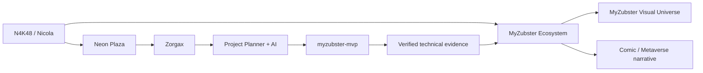

# N4K48 // MyZubster MVP

<p align="center">
  <a href="https://github.com/MyZubster-Ecosystem/myzubster">
    
  </a>
</p>

<p align="center">
  <strong>N4K48 · EXPLORER · NEON PLAZA · MYZUBSTER</strong><br>
  Profilo visuale di Nicola collegato all'ecosistema MyZubster e guidato da Zorgax.
</p>

<p align="center">
  <a href="https://github.com/MyZubster-Ecosystem/myzubster"><strong>MYZUBSTER CORE</strong></a> ·
  <a href="https://github.com/MyZubster-Ecosystem/MyZubster-Visual"><strong>VISUAL UNIVERSE</strong></a> ·
  <a href="https://github.com/MyZubster-Ecosystem/myzubster/blob/main/public/fumetto.html"><strong>COMIC UNIVERSE</strong></a> ·
  <a href="docs/N4K48.md"><strong>N4K48 PROFILE</strong></a>
</p>

> **Virtual identity:** N4K48  
> **Archetype:** Explorer  
> **Entry point:** Neon Plaza  
> **Operational path:** Project Planner + AI/Zorgax  
> **MyZubster connection:** ecosystem participant / visual profile  
> **Repository status:** MVP in sviluppo e validazione, non production-ready

## Visual identity // N4K48 × MyZubster

<table>
<tr>
<td width="50%" align="center">
<a href="https://github.com/MyZubster-Ecosystem/MyZubster-Visual/blob/main/assets/cyberpunk-series/MyZubster-Cyberpunk-Serie-01-Daniel-nel-Neon.png">

</a><br><strong>MYZUBSTER // NEON LANGUAGE</strong>
</td>
<td width="50%" align="center">
<a href="https://github.com/MyZubster-Ecosystem/MyZubster-Visual/blob/main/assets/cyberpunk-series/MyZubster-Cyberpunk-Serie-04-Rete-Decentralizzata.png">

</a><br><strong>MYZUBSTER // CONNECTED ECOSYSTEM</strong>
</td>
</tr>
<tr>
<td width="50%" align="center">
<a href="https://github.com/MyZubster-Ecosystem/MyZubster-Visual/blob/main/assets/zorgax/zorgax-cyberpunk-brand-ecosystem.jpg">

</a><br><strong>ZORGAX // OPERATIONAL GUIDE</strong>
</td>
<td width="50%" align="center">
<a href="https://github.com/MyZubster-Ecosystem/MyZubster-Visual/blob/main/assets/comic/collaborazione-futura.png">

</a><br><strong>MYZUBSTER // COLLABORATION</strong>
</td>
</tr>
</table>

### Connection graph



## N4K48 entra nel Metaverso MyZubster

N4K48 è l'identità virtuale scelta da Nicola per rappresentare il proprio percorso nel mondo visuale MyZubster. Il punto di partenza narrativo è **Neon Plaza**: un hub cyberpunk dal quale progetti, attività, evidenze e strumenti possono essere raccontati e collegati in modo visuale.

Il metaverso qui è una **rappresentazione narrativa / concept**, non una dichiarazione che esista già un ambiente 3D production-ready. Il repository contiene invece componenti tecnici reali e verificabili dell'MVP.

### Visual universe

| Visual | Ruolo |
| --- | --- |
| [Neon Plaza — H4X0R e N4K48](https://drive.google.com/file/d/1zE1MuqFcjU8xUp4NZJfZde9Rdxtu0cwt/view) | Ingresso di N4K48 nel Metaverso MyZubster |
| [MyZubster — Manifesto Neon](https://github.com/MyZubster-Ecosystem/MyZubster-Visual/blob/main/assets/comic/MyZubster-Cyberpunk-Visual-01-Manifesto-Neon.png) | Identità visuale dell'universo MyZubster |
| [MyZubster — Daniel nel Neon](https://github.com/MyZubster-Ecosystem/MyZubster-Visual/blob/main/assets/cyberpunk-series/MyZubster-Cyberpunk-Serie-01-Daniel-nel-Neon.png) | Linguaggio visuale cyberpunk / worldbuilding |
| [MyZubster — Rete Decentralizzata](https://github.com/MyZubster-Ecosystem/MyZubster-Visual/blob/main/assets/cyberpunk-series/MyZubster-Cyberpunk-Serie-04-Rete-Decentralizzata.png) | Rappresentazione visuale dell'ecosistema connesso |
| [Unmet Contributors Concept](https://github.com/MyZubster-Ecosystem/MyZubster-Visual/blob/main/assets/cyberpunk-series/MyZubster-Cyberpunk-Unmet-Contributors-Concept.png) | Spazio narrativo per nuovi contributor |
| [Zorgax Cyberpunk Brand Ecosystem](https://github.com/MyZubster-Ecosystem/MyZubster-Visual/blob/main/assets/zorgax/zorgax-cyberpunk-brand-ecosystem.jpg) | Zorgax come guida operativa e narrativa |
| [Collaborazione futura](https://github.com/MyZubster-Ecosystem/MyZubster-Visual/blob/main/assets/comic/collaborazione-futura.png) | Concept di collaborazione nell'ecosistema |

## First Mission

**Obiettivo narrativo:** trasformare l'ingresso di N4K48 in un percorso operativo verificabile.

1. Entrare nel Neon Plaza.
2. Collegare identità, progetto e stato del lavoro.
3. Usare il Project Planner / Zorgax come guida del percorso.
4. Produrre risultati concreti ed evidenze tecniche.
5. Sbloccare il passo successivo soltanto sulla base di attività realmente completate.

## Cosa è già stato completato nel repository

Queste sono componenti tecniche reali già integrate nell'MVP:

- creazione di osservazioni via API con risposta HTTP `201`;
- persistenza JSON configurabile e scrittura atomica;
- recupero delle osservazioni e test end-to-end;
- validazione JSON e coordinate;
- Docker non-root per sviluppo locale;
- volume persistente e health check;
- CI che costruisce e verifica il container;
- avvio API con Gunicorn e shutdown Docker pulito;
- integrazione locale Ollama + Qdrant;
- endpoint RAG che recupera osservazioni pertinenti e genera risposte basate sul contesto locale.

## Collegamento a MyZubster

N4K48 non è presentato come un progetto isolato. Questo repository rappresenta il percorso tecnico di Nicola e rimanda esplicitamente ai nodi pubblici MyZubster:

- **Core ecosystem:** https://github.com/MyZubster-Ecosystem/myzubster
- **Visual canon:** https://github.com/MyZubster-Ecosystem/MyZubster-Visual
- **Comic universe:** https://github.com/MyZubster-Ecosystem/myzubster/blob/main/public/fumetto.html
- **N4K48 visual profile:** [`docs/N4K48.md`](docs/N4K48.md)

Il collegamento indica appartenenza narrativa e interoperabilità del percorso con l'ecosistema; non implica che ogni componente MyZubster sia già integrato tecnicamente in questo MVP.

## Workflow MyZubster

```text
OBSERVE → DOCUMENT → CONNECT → COLLABORATE → VERIFY → PUBLISH → REWARD
```

Il principio resta semplice: **visual e storytelling raccontano il percorso; codice, test, commit ed evidenze dimostrano ciò che è realmente stato completato.**

## Avvio rapido con Docker

```bash
git clone https://github.com/nicolaususnicola-lgtm/myzubster-mvp.git
cd myzubster-mvp
docker compose up --build -d
docker compose ps
```

Quando il container è `healthy`, apri:

- `http://localhost:5000/api/observations`

In Docker l'API viene eseguita con Gunicorn. Docker invia `SIGTERM` e concede 15 secondi al processo per completare uno shutdown pulito.

Prova la creazione di un'osservazione:

```bash
curl -X POST http://localhost:5000/api/observation \
  -H "Content-Type: application/json" \
  -d '{"description":"Prova Docker","latitude":44.0678,"longitude":12.5695}'
```

Controlla i log:

```bash
docker compose logs -f api
```

I dati sono conservati nel volume Docker `observations-data` e rimangono disponibili dopo il riavvio dei container.

```bash
# verifica il riavvio
docker compose restart api
docker compose ps

# arresta senza cancellare i dati
docker compose down

# verifica che non rimangano container attivi o terminati forzatamente
docker compose ps -a

# riavvia
docker compose up -d
```

Lo stop atteso è pulito. Se compare ancora `Exited (137)`, raccogli:

```bash
docker compose ps -a
docker compose logs --tail 100 api
docker inspect myzubster-mvp-api-1
```

> Non usare `docker compose down -v` se vuoi conservare le osservazioni: l'opzione `-v` elimina anche il volume dei dati.

## AI locale e RAG

Lo stack include Ollama sul computer host, Qdrant e Open WebUI. Prima dell'avvio scarica sia il modello conversazionale sia il modello di embedding:

```powershell
ollama pull mistral
ollama pull nomic-embed-text
docker compose up -d --build
```

Servizi locali:

- API MyZubster: `http://localhost:5000`
- Open WebUI: `http://localhost:3001`
- Qdrant: `http://localhost:6333/dashboard`
- Ollama: `http://localhost:11434`

Crea un'osservazione e interroga l'endpoint RAG:

```powershell
Invoke-RestMethod -Method Post -Uri "http://localhost:5000/api/observation" `
  -ContentType "application/json" `
  -Body '{"description":"Imballaggio riciclabile osservato nel marketplace","latitude":44.0678,"longitude":12.5695}'

Invoke-RestMethod -Method Post -Uri "http://localhost:5000/api/ai/ask" `
  -ContentType "application/json" `
  -Body '{"question":"Quali osservazioni riguardano la sostenibilità?"}'
```

L'endpoint genera gli embedding con Ollama, indicizza le osservazioni in Qdrant, recupera le fonti più pertinenti e chiede a Mistral una risposta basata soltanto sul contesto recuperato.

## Avvio senza Docker

```bash
python -m venv .venv
# Windows PowerShell: .venv\Scripts\Activate.ps1
# macOS/Linux: source .venv/bin/activate
python -m pip install -r requirements.txt
python src/api/server.py
```

L'avvio diretto con `python src/api/server.py` usa il server Flask soltanto per lo sviluppo locale. Il container usa Gunicorn.

## Test automatici

```bash
python -m pip install pytest
python -m pytest -v
```

## Identità N4K48

La scheda estesa e visuale di N4K48 è in [`docs/N4K48.md`](docs/N4K48.md).

## Contribuire

Vedi [CONTRIBUTING.md](CONTRIBUTING.md).

## Licenza

Vedi [LICENSE](LICENSE).

MYZ è un ledger interno di ricompensa e contabilità, non una valuta esterna.
