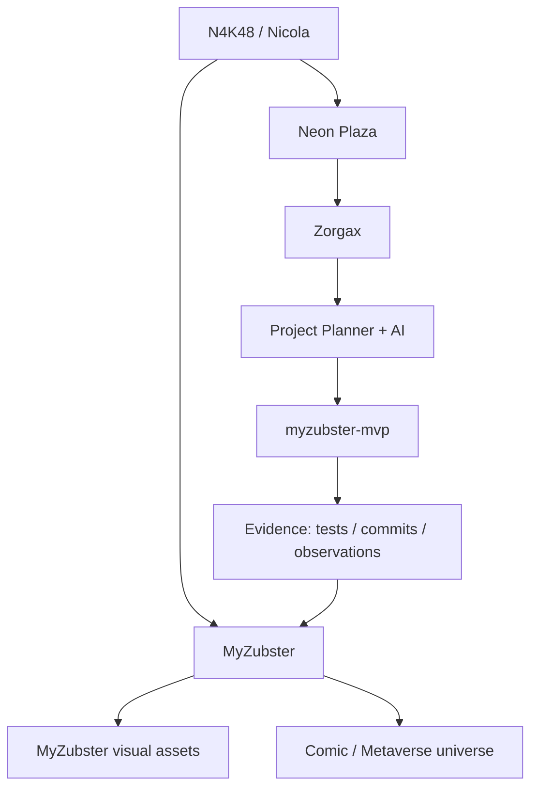

# N4K48 — MyZubster Virtual Profile

  

  <strong>N4K48 // EXPLORER // NEON PLAZA</strong> 
  Nicola · Project Planner path · AI/Zorgax guidance · MyZubster connected profile

  <a href="https://github.com/MyZubster-Ecosystem/myzubster"><strong>MYZUBSTER CORE</strong></a> ·
  <a href="https://github.com/MyZubster-Ecosystem/myzubster/blob/main/docs/metaverse/README.md"><strong>NEON PLAZA</strong></a> ·
  <a href="https://github.com/MyZubster-Ecosystem/MyZubster-Visual"><strong>VISUAL UNIVERSE</strong></a> ·
  <a href="https://github.com/MyZubster-Ecosystem/myzubster/blob/main/public/fumetto.html"><strong>COMIC UNIVERSE</strong></a> ·
  <a href="https://github.com/nicolaususnicola-lgtm/myzubster-mvp"><strong>N4K48 MVP</strong></a>

## Identity card

| Field | Value |
| --- | --- |
| **Name** | N4K48 |
| **Human participant** | Nicola |
| **Archetype** | Explorer |
| **Starting location** | Neon Plaza |
| **Operational path** | Project Planner + AI/Zorgax |
| **GitHub base** | `nicolaususnicola-lgtm/myzubster-mvp` |
| **Ecosystem** | MyZubster |
| **Visual canon** | MyZubster + MyZubster-Visual |
| **Current state** | narrative profile active / technical MVP active |

N4K48 è la rappresentazione virtuale scelta per raccontare il percorso di Nicola nell'ecosistema MyZubster. Il personaggio collega attività tecniche reali a un livello visuale cyberpunk, mantenendo sempre separati **storytelling/concept** ed **evidence verificabile**.

## Visual profile // MyZubster connected

<table>
<tr>
<td width="50%" align="center">
 <strong>N4K48 // NEON PLAZA</strong>
</td>
<td width="50%" align="center">
 <strong>MYZUBSTER // SYSTEM</strong>
</td>
</tr>
<tr>
<td width="50%" align="center">
 <strong>MYZUBSTER // ADOPTION PATH</strong>
</td>
<td width="50%" align="center">
 <strong>MYZUBSTER // CANONICAL ENTITIES</strong>
</td>
</tr>
<tr>
<td width="50%" align="center">
 <strong>ZORGAX // GUIDE LAYER</strong>
</td>
<td width="50%" align="center">
 <strong>MYZUBSTER // CONNECTED NETWORK</strong>
</td>
</tr>
</table>

### Ecosystem connection

## Neon Plaza — First Mission

Il primo capitolo è l'ingresso nel **Neon Plaza**, l'hub narrativo da cui N4K48 collega:

- progetto attivo;
- task e prossimi passi;
- osservazioni raccolte;
- evidenze tecniche;
- AI locale;
- stato del percorso;
- collegamenti con MyZubster e Zorgax.

### Mission objective

> Trasformare l'ingresso nel metaverso in un percorso operativo tracciabile: identità → progetto → azione → evidenza → risultato.

La componente visuale del Neon Plaza racconta il percorso; l'esistenza e lo stato delle funzionalità tecniche restano dimostrati da codice, test, commit e runtime verificabile.

## Verified technical progress

### Observation flow

Completato nel repository:

- POST di una nuova osservazione con HTTP `201`;
- persistenza JSON e scrittura atomica;
- lettura via GET;
- test end-to-end isolato;
- timestamp e validazione JSON/coordinate;
- path configurabile per la persistenza.

### Reproducible Docker environment

Completato nel repository:

- immagine Python slim;
- esecuzione non-root;
- Docker Compose;
- volume persistente;
- health check;
- CI con build, start, POST `201` e GET di verifica;
- Gunicorn nel container e shutdown pulito con `SIGTERM`.

### Local AI / RAG

Completato nel repository:

- Ollama sul computer host;
- Qdrant per indicizzazione e retrieval;
- Open WebUI;
- embedding locali con `nomic-embed-text`;
- modello conversazionale locale;
- endpoint `/api/ai/ask`;
- risposta generata usando il contesto recuperato dalle osservazioni.

## MyZubster visual links

### Visual locali versionate nel repository MyZubster

- [Neon Plaza — H4X0R e N4K48](https://github.com/MyZubster-Ecosystem/myzubster/blob/main/docs/visuals/drive-import-2026-09-03/Neon-Plaza-H4X0R-N4K48-Cyberpunk.jpg)
- [MyZubster System Visual](https://github.com/MyZubster-Ecosystem/myzubster/blob/main/docs/visuals/drive-import-2026-09-03/MYZUBSTER-SYSTEM-VISUAL-001.png)
- [Ecosystem Adoption Visual](https://github.com/MyZubster-Ecosystem/myzubster/blob/main/docs/visuals/drive-import-2026-09-03/MyZubster-Ecosystem-Adoption-Visual.png)
- [16 Canonical Entities Roster](https://github.com/MyZubster-Ecosystem/myzubster/blob/main/docs/visuals/drive-import-2026-09-03/MyZubster-16-Canonical-Entities-Roster.jpg)
- [Pacchetto completo visual importate](https://github.com/MyZubster-Ecosystem/myzubster/tree/main/docs/visuals/drive-import-2026-09-03)

### MyZubster cyberpunk universe

- [Manifesto Neon](https://github.com/MyZubster-Ecosystem/MyZubster-Visual/blob/main/assets/comic/MyZubster-Cyberpunk-Visual-01-Manifesto-Neon.png)
- [Daniel nel Neon](https://github.com/MyZubster-Ecosystem/MyZubster-Visual/blob/main/assets/cyberpunk-series/MyZubster-Cyberpunk-Serie-01-Daniel-nel-Neon.png)
- [Rete Decentralizzata](https://github.com/MyZubster-Ecosystem/MyZubster-Visual/blob/main/assets/cyberpunk-series/MyZubster-Cyberpunk-Serie-04-Rete-Decentralizzata.png)
- [Unmet Contributors Concept](https://github.com/MyZubster-Ecosystem/MyZubster-Visual/blob/main/assets/cyberpunk-series/MyZubster-Cyberpunk-Unmet-Contributors-Concept.png)
- [Zorgax Cyberpunk Brand Ecosystem](https://github.com/MyZubster-Ecosystem/MyZubster-Visual/blob/main/assets/zorgax/zorgax-cyberpunk-brand-ecosystem.jpg)
- [Collaborazione futura](https://github.com/MyZubster-Ecosystem/MyZubster-Visual/blob/main/assets/comic/collaborazione-futura.png)

## Character rules

1. **Evidence first** — un risultato è completato solo quando esiste una prova tecnica o documentale verificabile.
2. **Concept is not evidence** — visual, fumetto e metaverso raccontano la visione ma non dimostrano da soli una funzione.
3. **Progress must be real** — nessun badge o avanzamento viene inventato.
4. **Human control** — decisioni sensibili, pubblicazioni definitive, pagamenti o azioni irreversibili restano sotto controllo umano.

## Next mission

Il prossimo capitolo può collegare il **Project Planner** al lavoro reale del repository, mostrando nel Neon Plaza soltanto stati derivati da task, test, commit ed evidenze realmente presenti.

Possibili nodi successivi:

- Project Planner dashboard;
- mappa delle osservazioni;
- timeline delle evidenze;
- AI assistant locale;
- missioni tecniche con stato `planned / active / verified`;
- collegamento visuale al MyZubster ecosystem.

---

**Status:** MyZubster-linked visual profile active · MVP technical development active · visual storytelling separated from verified technical evidence.
