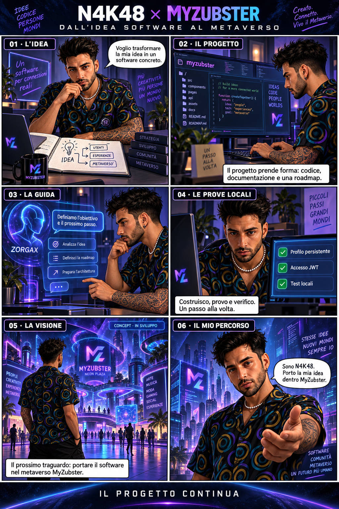
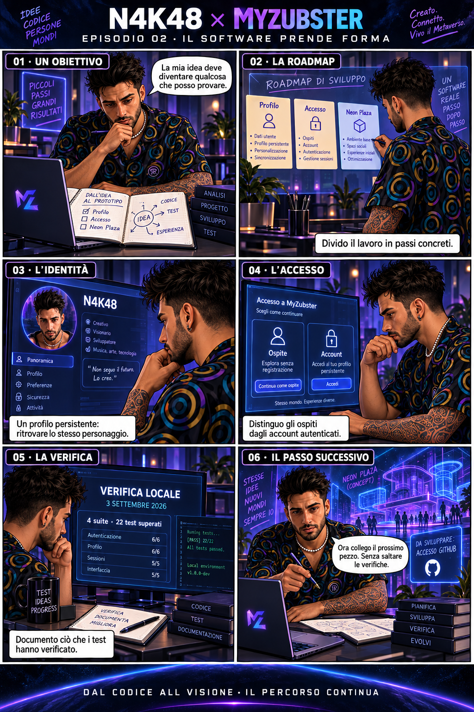
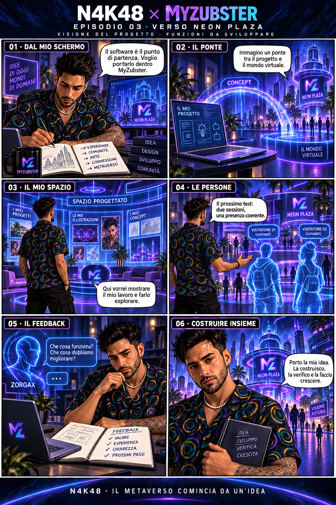

# N4K48 × MyZubster — Dall’idea software al metaverso

Tre tavole narrative sul percorso di N4K48: idea software, sviluppo e visione del metaverso MyZubster. Visual create con assistenza AI, mantenendo l'identità del personaggio scelta da Nicola.

## 01 — Dall’idea software al metaverso

## 02 — Il software prende forma

## 03 — Verso Neon Plaza

## Contesto delle visual

Le interfacce e gli ambienti sono illustrazioni, non schermate del software. Le scene future rappresentano funzioni da sviluppare e verificare. Il totale di 4 suite e 22 test locali fa riferimento alla verifica documentata del 3 settembre 2026; i conteggi disegnati per singola suite sono illustrativi.

Queste tavole non attestano un rilascio in produzione o un mint NFT e non assegnano diritti su materiali esterni MyZubster.
